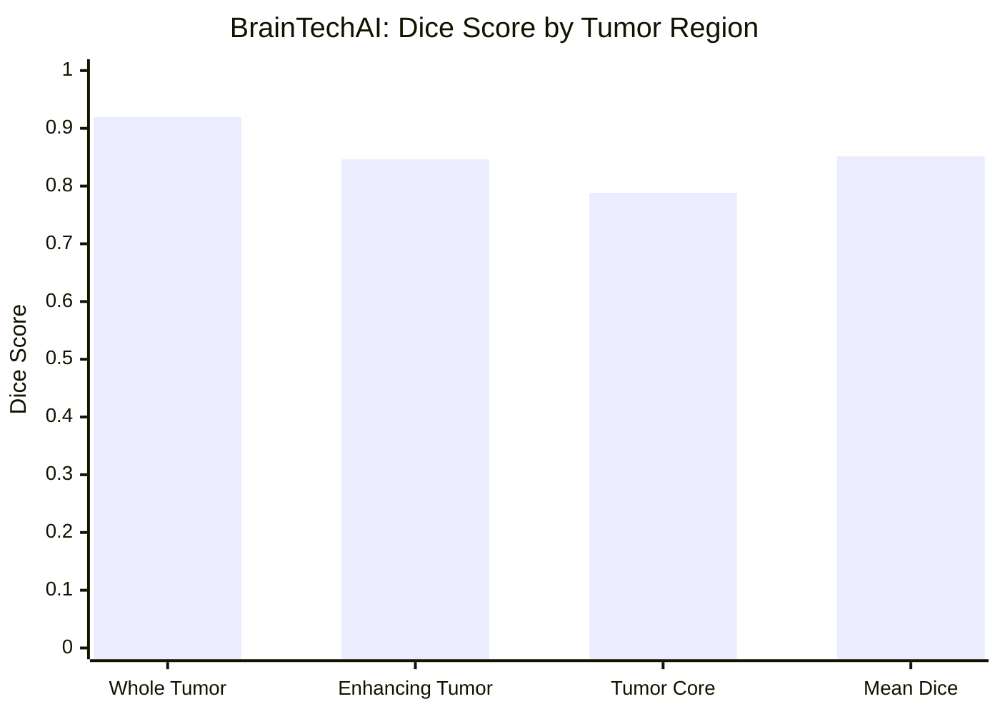

<!-- ═══════════════════════════ HEADER ═══════════════════════════ -->
<p align="center">
  
</p>

<p align="center">
  <a href="https://github.com/zaed-nusirat0">
    
  </a>
</p>

<p align="center">
  <a href="https://linkedin.com/in/zaid-nserat-192a7a275"></a>
  <a href="https://kaggle.com/zaed2003"></a>
  <a href="mailto:zm463454@gmail.com"></a>
  <a href="https://github.com/zaed-nusirat0?tab=repositories"></a>
  
</p>


<!-- ═══════════════════════════ ABOUT ═══════════════════════════ -->
##  About Me

<table>
<tr>
<td width="58%" valign="top">

```python
class ZaidNserat:
    def __init__(self):
        self.location   = "Amman, Jordan 🇯🇴"
        self.role       = "Full Stack Developer @ Carseer"
        self.education  = "B.Sc. Data Science & AI — Hashemite University"
        self.languages  = ["Arabic", "English"]

    @property
    def expertise(self):
        return {
            "AI / ML":   ["PyTorch", "TensorFlow", "MONAI", "Scikit-learn"],
            "Vision":    ["nnU-Net", "SwinUNETR", "Vision Transformers"],
            "Data Eng":  ["Apache Airflow", "ETL/ELT", "Star Schema"],
            "Backend":   ["C# / .NET", "Flask", "FastAPI", "Oracle"],
            "Cloud":     ["AWS EC2", "AWS S3", "Docker", "RunPod"],
        }

    def fun_fact(self):
        return "Kaggle Expert who never stops learning 🚀"
```

</td>
<td width="42%" align="center" valign="middle">
  
</td>
</tr>
</table>

<!-- ═══════════════════════════ HIGHLIGHTS ═══════════════════════════ -->
<p align="center">
  
  
  
  
</p>


<!-- ═══════════════════════════ TECH STACK ═══════════════════════════ -->
## ⚡ Tech Stack

<p align="center">
  
  <br/>
  
</p>

<p align="center">
  
  
  
  
  
  
  
  
  
  
  
  
</p>


<!-- ═══════════════════════════ EXPERIENCE ═══════════════════════════ -->
## 💼 Experience

<table>
<tr>
<td align="center" width="25%">
  <h3>🧑‍💻</h3>
  <b>Full Stack Developer</b><br/>
  <sub><b>Carseer</b></sub><br/>
  <sub>Aug 2025 – Present</sub><br/><br/>
  
  
</td>
<td align="center" width="25%">
  <h3>🤖</h3>
  <b>AI & Data Science Trainee</b><br/>
  <sub><b>AI Coding Academy (Egypt)</b></sub><br/>
  <sub>Oct 2024 – Present</sub><br/><br/>
  
  
</td>
<td align="center" width="25%">
  <h3>🧪</h3>
  <b>Intern</b><br/>
  <sub><b>Tahaluf AI Emarat</b></sub><br/>
  <sub>Oct 2024 – Apr 2025</sub><br/><br/>
  
</td>
<td align="center" width="25%">
  <h3>📊</h3>
  <b>Data Scientist Intern</b><br/>
  <sub><b>Orange Jordan Coding Academy</b></sub><br/>
  <sub>Aug 2023 – Oct 2023</sub><br/><br/>
  
</td>
</tr>
</table>

<details>
<summary>📜 <b>Click to see full details</b></summary>
<br/>

**🧑‍💻 Full Stack Developer · Carseer**
- Developing full-stack web applications with **C#** and **.NET REST API** architecture
- Designing and managing relational databases with **Oracle Database** and **Toad**
- Building RESTful APIs for frontend-backend integration
- Working with cross-functional teams to deliver scalable, data-driven solutions

**🤖 AI & Data Science Trainee · AI Coding Academy (Egypt)**
- Intensive 8-month program covering AI, ML, Data Science, NLP and Computer Vision
- Built projects in image classification, text analysis and neural networks

**🧪 Intern · Tahaluf AI Emarat Technical Solutions**
- Hands-on work in Statistics, Probability, Python and Advanced Machine Learning

**📊 Data Scientist Intern · Orange Jordan Coding Academy**
- Developed predictive models and used Big Data tools to solve real-world ML problems

</details>


<!-- ═══════════════════════════ FLAGSHIP PROJECT ═══════════════════════════ -->
## 🧠 Flagship Project

<p align="center">
  
</p>

<table>
<tr>
<td width="45%" align="center" valign="middle">
  
</td>
<td width="55%" align="center" valign="middle">

<h3>🏆 Model Results</h3>
<sub>Evaluated on 210 held-out MRI cases</sub>
<br/><br/>


<br/>

<br/>

<br/>

<br/><br/>


</td>
</tr>
</table>




<!-- ═══════════════════════════ PROJECTS ═══════════════════════════ -->
## 🚀 Featured Projects

<p align="center">
  <a href="https://github.com/zaed-nusirat0/browser-history-ETL-warehouse">
    
  </a>
  <a href="https://github.com/zaed-nusirat0/Gold-Price-Predictor-AI-Powered-Web-App">
    
  </a>
  <a href="https://github.com/zaed-nusirat0/Intent-Detection-Model-API---99-Accuracy">
    
  </a>
  <a href="https://github.com/zaed-nusirat0/Car-Price-Predictor-AI-Powered-Web-App">
    
  </a>
  <a href="https://github.com/zaed-nusirat0/ETL-RECOMMENDATION-SYSTEM">
    
  </a>
  <a href="https://github.com/zaed-nusirat0/Car-Centers-Sentiment-Analysis">
    
  </a>
</p>

<details>
<summary>📂 <b>More projects</b></summary>
<br/>

| Project | Area |
|:--|:--|
| 🌐 [Browsing Behavior Data Warehouse](https://github.com/zaed-nusirat0/browser-history-ETL-warehouse): Bronze→Silver→Gold pipeline on Airflow + PostgreSQL star schema + Streamlit BI + Groq LLM agent | Data Engineering |
| 💰 Income Evaluation: **highest score on Kaggle** + Flask prediction app | ML · Kaggle |
| ❤️ [Heart Disease Prediction](https://github.com/zaed-nusirat0/Heart-Disease-) | Classification |
| 🏦 [Loan Prediction](https://github.com/zaed-nusirat0/Loan-Prediction) | Classification |
| 📧 [Spam Email Classification](https://github.com/zaed-nusirat0/Email-Spam-Classification-NLP) | NLP |
| 😷 [Face Mask Detection](https://github.com/zaed-nusirat0/Face-Mask-Detection) | Computer Vision · CNN |
| 🩺 [Diabetes Model + FastAPI](https://github.com/zaed-nusirat0/Fast-Api-diabetes) | ML Deployment |
| 🛡️ [Insurance Cross-Selling](https://github.com/zaed-nusirat0/Binary-Classification-of-Insurance-Cross-Selling) | Kaggle Competition |
| 🎓 [Academic Success Classification](https://github.com/zaed-nusirat0/Classification-with-an-Academic-Success) | Kaggle Competition |
| 🚗 [Used Car Price Regression](https://github.com/zaed-nusirat0/car-price-prediction) | Regression |
| 📚 [Exploring Udemy: Data Analysis](https://github.com/zaed-nusirat0/Exploring-Udemy-A-Complete-Data-Analysis-) | EDA |

</details>


<!-- ═══════════════════════════ STATS ═══════════════════════════ -->
## 📊 GitHub Analytics

<p align="center">
  
  
</p>

<p align="center">
  
</p>

<p align="center">
  
</p>
<!-- ═══════════════════════════ FOOTER ═══════════════════════════ -->
<p align="center">
  <b>💬 Ask me about Data Science, Deep Learning, Computer Vision, Data Engineering & Full Stack Development</b>
  <br/><br/>
  <a href="mailto:zm463454@gmail.com"></a>
</p>

<p align="center">
  
</p>
